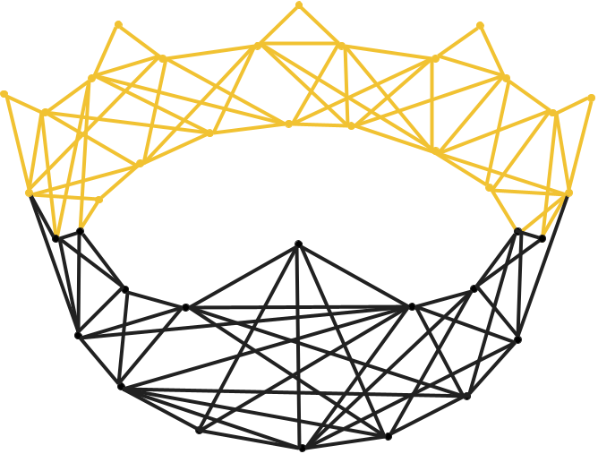

<p align="center">
  
</p>

# nimnet

[](https://github.com/yoichiozaki/nimnet/actions/workflows/ci.yml)
[](https://github.com/yoichiozaki/nimnet/actions/workflows/coverage.yml)
[](https://opensource.org/licenses/MIT)

A comprehensive network science library for [Nim](https://nim-lang.org/), inspired by Python's [NetworkX](https://networkx.org/).

## Features

- **Graph types**: Undirected (`Graph`), directed (`DiGraph`), multigraphs (`MultiGraph`, `MultiDiGraph`) with generic node types
- **Graph views**: Lazy subgraph views (`GraphView`, `DiGraphView`) — zero-copy, read-only
- **CompactGraph**: Cache-friendly CSR (Compressed Sparse Row) representation
- **StaticGraph**: Compile-time graph construction templates
- **48 Algorithm modules**: BFS/DFS traversal, shortest paths (Dijkstra, Bellman-Ford, A*, Floyd-Warshall, Johnson's), centrality (degree, closeness, PageRank, eigenvector, Katz, HITS), connected/strongly connected components, clustering coefficients, community detection (greedy modularity, Louvain), MST (Kruskal, Prim), max flow (Edmonds-Karp), topological sort, transitive closure/reduction, graph isomorphism (VF2), planarity testing, TSP heuristics, min-cost flow, tree decomposition, k-core decomposition, clique enumeration, graph coloring, bipartite matching, Eulerian/Hamiltonian paths, link prediction, bridges & articulation points, ego graphs, distance measures, simple paths, efficiency, rich-club coefficient, Wiener index, cycle basis, matching, graph products, small-world metrics, graph hashing (WL), similarity (SimRank, graph edit distance), spectral analysis, triads, voronoi, LCA, layout (spring, circular, shell), minors, cuts, parallel algorithms (PageRank, betweenness, closeness, clustering, Johnson's)
- **10 Generator modules**: Classic graphs (complete, cycle, path, star, wheel, grid, barbell, lollipop, ladder, etc.), random graphs (Erdős-Rényi, Barabási-Albert, Watts-Strogatz, random regular, stochastic block model), small/famous graphs (Petersen, karate club), tree generators, line graph, lattice (grid2d, triangular, hypercube), geometric graphs (random geometric, Waxman), community generators (caveman, planted partition), degree sequence generators (configuration model, Havel-Hakimi), directed graph generators (GN, GNR, GNC, random k-out)
- **10 I/O formats**: Edge list, adjacency list, JSON graph, DOT/Graphviz, GML, GraphML, GEXF, Graph6, Pajek, SVG export
- **Operators**: Union, complement, intersection, difference, node relabeling, directed ↔ undirected conversion
- **Builder DSL**: Fluent graph construction with method chaining and `buildGraph` template
- **Built-in datasets**: Dolphins social network, Florentine families, les misérables

## Installation

```bash
nimble install nimnet
```

Or add to your `.nimble` file:

```nim
requires "nimnet >= 0.1.0"
```

## Quick Start

```nim
import nimnet

# Create an undirected graph
var g = newGraph[int]()
g.addNode(1)
g.addNode(2)
g.addNode(3)
g.addEdge(1, 2)
g.addEdge(2, 3)
g.addEdge(1, 3)

echo "Nodes: ", g.numberOfNodes()  # 3
echo "Edges: ", g.numberOfEdges()  # 3

# Iterate neighbors
for neighbor in g.neighbors(1):
  echo neighbor  # 2, 3

# Shortest path
echo shortestPath(g, 1, 3)  # @[1, 3]

# Create a directed graph
var dg = newDiGraph[string]()
dg.addEdge("A", "B")
dg.addEdge("B", "C")
echo dg.hasPath("A", "C")  # true

# Graph generators
let complete = completeGraph[int](5)
let er = erdosRenyiGraph[int](100, 0.05)

# Builder DSL
let h = buildGraph[int]:
  nodes [1, 2, 3, 4, 5]
  edges [(1,2), (2,3), (3,4), (4,5)]

# Centrality analysis
let pr = pageRank(complete)
let communities = louvainCommunities(er)

# All-pairs shortest paths
let dist = floydWarshall(g)

# Graph properties
echo isTree(g)      # false (has a cycle)
echo isComplete(g)  # true (K3)

# I/O
writeGml(g, "my_graph.gml")
let loaded = readGml("my_graph.gml")
```

## Algorithm Modules

| Category | Module | Algorithms |
|----------|--------|-----------|
| Traversal | `traversal` | BFS, DFS (edges, tree, layers, preorder, postorder) |
| Shortest Paths | `shortest_paths` | Dijkstra, Bellman-Ford, A*, unweighted BFS |
| All-Pairs Shortest | `all_pairs_shortest` | Floyd-Warshall, Johnson's algorithm |
| Components | `components` | Connected, strongly connected (Tarjan), weakly connected, condensation |
| Centrality | `centrality` | Degree, closeness, PageRank, eigenvector, Katz, HITS |
| Clustering | `clustering` | Clustering coefficient, transitivity, triangles |
| Community | `community`, `louvain` | Greedy modularity, Louvain method |
| MST | `mst` | Kruskal, Prim |
| DAG | `dag` | Topological sort, cycle detection, ancestors, descendants, transitive closure/reduction |
| Flow | `flow` | Edmonds-Karp max flow, minimum cut |
| Min-Cost Flow | `min_cost_flow` | Successive shortest path |
| Connectivity | `connectivity` | Node/edge connectivity, resilience |
| Isomorphism | `isomorphism` | VF2 graph isomorphism |
| Planarity | `planarity` | Euler's formula + K5/K3,3 subgraph detection |
| TSP | `tsp` | Nearest neighbor, greedy, 2-opt |
| Tree Decomposition | `tree_decomposition` | Treewidth upper bound |
| Properties | `properties` | isTree, isForest, isRegular, isComplete, girth |
| Link Prediction | `link_prediction` | Common neighbors, Jaccard, Adamic-Adar |
| k-Core | `core` | Core decomposition, k-core, k-shell |
| Statistics | `stats` | Degree histogram, assortativity |
| Cliques | `clique` | Bron-Kerbosch, clique number |
| Independent Set | `independent_set` | Maximum independent set, vertex cover |
| Dominating Set | `dominating` | Minimum dominating set |
| Coloring | `coloring` | Greedy coloring (largest-first, DSATUR) |
| Bipartite | `bipartite` | Bipartiteness, maximum matching |
| Euler | `euler` | Eulerian circuits/paths, Hamiltonian detection |
| Bridges | `bridges` | Bridges (cut edges), articulation points, biconnected components |
| Ego Graph | `ego` | Ego graph extraction (k-hop neighborhood subgraph) |
| Distance Measures | `distance_measures` | Diameter, radius, center, periphery, eccentricity, barycenter |
| Simple Paths | `simple_paths` | All simple paths enumeration |
| Efficiency | `efficiency` | Global efficiency, local efficiency |
| Rich Club | `richclub` | Rich-club coefficient |
| Wiener Index | `wiener` | Wiener index |
| Cycles | `cycles` | Cycle basis, simple cycles (directed) |
| Matching | `matching` | Maximal matching, max/min-weight matching |
| Graph Products | `graph_products` | Cartesian, tensor, strong, lexicographic product |
| Small-World | `smallworld` | Small-world sigma (σ) and omega (ω) coefficients |
| Graph Hashing | `graph_hashing` | Weisfeiler-Lehman graph/subgraph hashes |
| Similarity | `similarity` | SimRank, graph edit distance |
| Spectral | `spectral` | Laplacian spectrum, algebraic connectivity, spectral radius, Fiedler vector |
| Triads | `triads` | Triad census, triadic closure |
| Voronoi | `voronoi` | Voronoi partitions on graphs |
| LCA | `lca` | Lowest common ancestor in DAGs |
| Layout | `layout` | Spring (Fruchterman-Reingold), circular, shell, random, spectral layout |
| Minors | `minors` | Edge contraction, graph minors |
| Cuts | `cuts` | Cut size, conductance, normalized cut, edge expansion, node boundary |
| Parallel | `parallel` | Parallel PageRank, betweenness, closeness, clustering, Johnson's (malebolgia) |

## Additional Data Structures

| Type | Description |
|------|-------------|
| `MultiGraph[N]` | Undirected multigraph supporting parallel edges |
| `MultiDiGraph[N]` | Directed multigraph supporting parallel edges |
| `GraphView` / `DiGraphView` | Lazy, zero-copy read-only graph views |
| `CompactGraph` / `CompactDiGraph` | Cache-friendly CSR (Compressed Sparse Row) representation |
| `StaticGraph` | Compile-time graph construction via templates |

## Performance

Benchmark results comparing NimNet (compiled Nim, pure implementation) vs NetworkX 3.6 (Python + scipy/numpy C backend) on Erdős-Rényi random graphs. Times are in seconds; lower is better.

**Medium graph (1,000 nodes, 5,000 edges):**

| Benchmark | NimNet | NetworkX | Ratio |
|-----------|--------|----------|-------|
| Graph creation | 0.001 | 0.005 | **NimNet 5×** |
| BFS | 0.001 | 0.002 | **NimNet 2×** |
| DFS | 0.001 | 0.001 | ~1× |
| Dijkstra | 0.002 | 0.001 | 2× |
| PageRank | 0.007 | 0.004 | 1.8×\* |
| Connected components | 0.001 | 0.000 | — |
| MST (Kruskal) | 0.005 | 0.005 | ~1× |
| Louvain | 0.625 | 0.091 | 6.9× |
| Clustering | 0.013 | 0.015 | **NimNet 1.2×** |
| Triangles | 0.004 | 0.004 | ~1× |

**Large graph (10,000 nodes, 50,000 edges):**

| Benchmark | NimNet | NetworkX | Ratio |
|-----------|--------|----------|-------|
| Graph creation | 0.014 | 0.051 | **NimNet 3.6×** |
| BFS | 0.008 | 0.015 | **NimNet 1.9×** |
| DFS | 0.006 | 0.010 | **NimNet 1.7×** |
| Dijkstra | 0.040 | 0.012 | 3.3× |
| PageRank | 0.079 | 0.035 | 2.3×\* |
| Connected components | 0.006 | 0.005 | 1.2× |
| MST (Kruskal) | 0.077 | 0.088 | **NimNet 1.1×** |

\*NetworkX PageRank uses scipy (C/Fortran); NimNet is pure Nim.

> **Note:** NimNet is a pure Nim implementation with no C/Fortran bindings. NetworkX leverages NumPy/SciPy for numerically intensive algorithms like PageRank. NimNet outperforms NetworkX on graph creation, traversal (BFS/DFS), and MST benchmarks. See [`benchmarks/`](benchmarks/) for details and reproduction scripts.

## Examples

See the [`examples/`](examples/) directory for complete, runnable programs:

- **Social network analysis** — centrality, clustering, community detection on the karate club graph
- **Shortest path demo** — Dijkstra, Bellman-Ford, A* on a weighted city network
- **Graph I/O roundtrip** — export/import in all 10 supported formats
- **Network resilience** — bridges, articulation points, connectivity analysis

```bash
nim c -r -p:src examples/social_network_analysis.nim
```

## Development

### Using DevContainer (Recommended)

1. Install [Docker](https://www.docker.com/) and [VS Code Dev Containers extension](https://marketplace.visualstudio.com/items?itemName=ms-vscode-remote.remote-containers)
2. Open the project in VS Code
3. Click "Reopen in Container" when prompted
4. Run `nimble test`

### Manual Setup

1. Install [Nim](https://nim-lang.org/install.html) >= 2.0.0
2. Clone the repository
3. Run `nimble test`

## Architecture

Design decisions are documented as [Architecture Decision Records](docs/adr/) (ADRs).

## Contributing

See [CONTRIBUTING.md](CONTRIBUTING.md) for guidelines.

## License

MIT — see [LICENSE](LICENSE).
