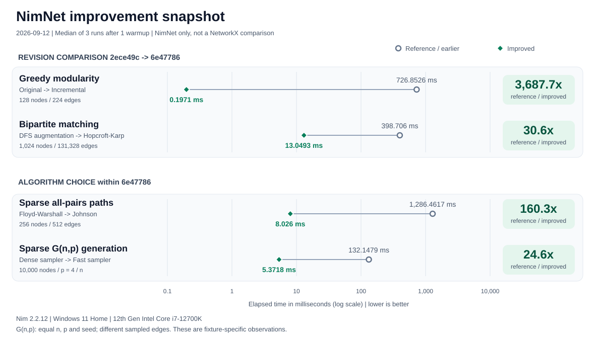
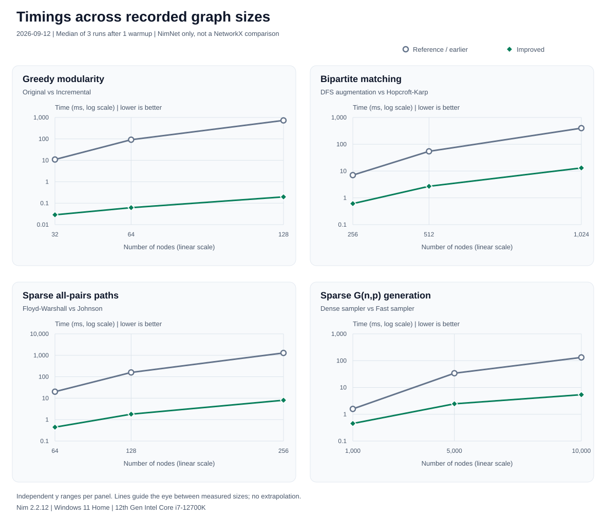

# NimNet Benchmark Suite

Reproducible comparisons with Python's [NetworkX](https://networkx.org/), plus
targeted before/after workloads for the library improvement backlog.

## Results at a glance

**These figures compare NimNet revisions or algorithms, not NimNet with
NetworkX.** Hollow circles show the reference; filled diamonds show the
improved method. Elapsed-time axes are logarithmic so both small and large
changes remain visible. Lower time is better.



The snapshot uses the recorded 2026-09-12 evidence, not newly sampled results.
See [size scaling](#recorded-size-scaling),
[exact timings and conditions](#recorded-improvement-results-2026-09-12), or
[run the benchmarks](#running-benchmarks).

## Benchmarks

| Benchmark | Description |
|-----------|-------------|
| `graph_creation` | Build the supplied graph, excluding random generation and file I/O |
| `bfs` | Count yielded BFS tree edges from node 0 in both libraries |
| `dfs` | Materialize DFS preorder nodes |
| `dijkstra` | Materialize a weighted shortest path |
| `pagerank` | PageRank on the same unweighted graph |
| `connected_components` | Materialize connected-component sets |
| `mst_kruskal` | Materialize Kruskal minimum spanning tree edges |
| `louvain` | Louvain community detection |
| `clustering` | Average clustering coefficient |
| `triangles` | Triangle counts for all nodes |

| Size | Nodes | Edges |
|------|-------|-------|
| small | 100 | 500 |
| medium | 1,000 | 5,000 |
| large | 10,000 | 50,000 |

All workloads run at all sizes by default. Results are workload- and
hardware-dependent; neither implementation is claimed to win universally.

## Running benchmarks

Prerequisites: Nim >= 2.0.0, installed Nimble dependencies, and Python >= 3.12.
Install the pinned comparison environment from `requirements.txt`. Fixture
generation, result validation and metadata collection use only the stdlib.

**Windows (PowerShell):**

```powershell
python -m pip install -r benchmarks\requirements.txt
.\benchmarks\run_benchmarks.ps1
.\benchmarks\run_benchmarks.ps1 -Micro
```

**Linux/macOS (Bash):**

```bash
python -m pip install -r benchmarks/requirements.txt
bash benchmarks/run_benchmarks.sh
bash benchmarks/run_benchmarks.sh --micro
```

Use `-SkipNetworkX` / `--nim-only` to explicitly run without NetworkX.
An unavailable requested dependency, failed compiler/executable, invalid
configuration or malformed/incomplete CSV makes the runner fail. Previous
results are not silently reused.

### Configuration

| Variable | Meaning |
|----------|---------|
| `BENCH_RUNS` | Positive timed repetition count; default 5, CI 3 |
| `BENCH_SIZES` | Comma-separated subset of `small,medium,large`; unknown/empty entries fail |
| `BENCH_FIXTURES` | Optional fixture directory; default `benchmarks/results/fixtures` |

For a quick smoke run in PowerShell:

```powershell
$env:BENCH_SIZES = "small"
$env:BENCH_RUNS = "1"
.\benchmarks\run_benchmarks.ps1
Remove-Item Env:BENCH_SIZES, Env:BENCH_RUNS
```

One-run smoke output is not performance evidence.

## Output

Both implementations output the same CSV schema:

```text
library,benchmark,size,nodes,edges,time_seconds
```

Results are written to `benchmarks/results`: `nimnet.csv`, `networkx.csv`,
`combined.csv` and `metadata.json`. Micro results use a `micro_` prefix.
Metadata records the platform, compiler/package versions, Git revision, dirty
state, repetition count and SHA-256 fixture hashes. CI uploads the input fixtures
alongside the results so the exact graphs can be reused.

## Methodology

`fixtures.py` generates a versioned JSON G(n,m) fixture once per size, including
all node IDs and canonical undirected edges. Weights are integer thousandths
between 1 and 10. Both libraries load and validate the same bytes; they do not
independently regenerate supposedly identical graphs from different RNGs.
Weighted and unweighted workloads share topology. Parsing and generation are
outside timed sections, including the graph-construction workload.

All timing uses monotonic elapsed clocks, one untimed warmup and the median of
the requested repetitions (the mean of the two middle samples for even counts).
Runners execute libraries sequentially, not as competing background processes.
Builds use `--threads:on -d:release --opt:speed`, **not `-d:danger`**; assertions
and runtime checks remain enabled. Do not run other builds/benchmarks
concurrently when collecting evidence.

BFS counts edges in both implementations rather than comparing iteration with
NetworkX tree construction. DFS, shortest paths, component lists, MST edge
lists, PageRank maps and triangle maps are materialized consistently.
Heuristic algorithms can produce different partitions because iteration orders
and implementations differ; timings do not establish equal community quality.
NetworkX PageRank uses a SciPy
backend; the comparison is between user-facing implementations, not identical
machine-code kernels.

PageRank uses unit transitions, `alpha=0.85`, at most 100 iterations, and a total
L1 convergence tolerance of `1e-6` in both implementations. NetworkX therefore
receives `tol=1e-6/n` and `weight=None`. Both runners check nonnegative ranks
and conserved probability mass. Louvain uses `resolution=1.0`, nonzero seed
`42` and at most 20 levels; NetworkX receives `threshold=0.0` to match strictly
positive accepted gains. NimNet additionally caps each level at 100 passes,
which is not a public NetworkX parameter.

Historical tables generated with different random graphs, CPU-versus-elapsed
clocks or concurrent runners have been retired. They cannot substantiate
claims about the current code.

## Targeted improvement workloads

`bench_regressions.nim` covers clique-ring greedy modularity, triangular
bipartite matching, sparse weighted all-pairs paths, and sparse G(n,p)
generation. Its default is three repetitions after one warmup.

```powershell
nim c --threads:on -d:release --opt:speed -p:src `
  --nimcache:build\nimcache\regressions -o:build\bench_regressions.exe `
  benchmarks\bench_regressions.nim
.\build\bench_regressions.exe
```

For a before/after comparison, extract only `src` from the baseline commit
`2ece49c` into a separate build directory with `git archive`, and compile the
**same current benchmark driver** with `-p:` pointing to that source tree.
Compile both binaries before timing; never switch or overwrite the working
source tree just to benchmark it.

Community/matching timings compare identical deterministic graphs across
revisions. Floyd-Warshall versus the new undirected Johnson overload uses the
same weighted graph. Dense versus fast G(n,p) compares equal `(n, p, seed)`
parameters, **not identical output edges**; actual edge counts are recorded.
The new sparse generator intentionally does not reproduce the dense
generator's random stream.

### Recorded improvement results (2026-09-12)

Baseline `2ece49c` and candidate `6e47786` were built with the same driver,
Nim 2.2.12 and release/speed options on Windows 11, Intel Core i7-12700K
(12 cores, 20 logical processors). The table uses three-run medians after
one warmup, in milliseconds. All four measured cases exceeded the 2x
acceptance target; these are fixture-specific observations, not general
performance guarantees.

| Workload | Comparison | Earlier/baseline | Improved | Ratio |
|----------|------------|------------------|----------|-------|
| Greedy modularity, 128 nodes / 224 edges | Baseline vs candidate | 726.8526 ms | 0.1971 ms | 3,687.7x |
| Bipartite matching, 1,024 nodes / 131,328 edges | Baseline vs candidate | 398.7060 ms | 13.0493 ms | 30.6x |
| Sparse APSP, 256 nodes / 512 edges | Candidate Floyd vs candidate Johnson | 1,286.4617 ms | 8.0260 ms | 160.3x |
| G(n,p), 10,000 nodes, p=0.0004 | Candidate dense vs candidate fast generator | 132.1479 ms | 5.3718 ms | 24.6x |

Raw [baseline CSV](evidence/2026-09-12-before.csv),
[candidate CSV](evidence/2026-09-12-after.csv), and
[environment, hashes and validated ratios](evidence/2026-09-12-environment.json)
include every measured size, not just the highlighted cases. The final G(n,p)
outputs contain 19,951 and 20,052 edges respectively, as expected for different
samplers of the same distribution.

### Recorded size scaling

Every recorded size is shown below, not just the largest speedup. Each panel
has its own logarithmic time range; node counts use a linear axis. Lines only
connect measurements and do not extrapolate performance or establish an
asymptotic complexity bound.



The first two panels compare `2ece49c` with `6e47786`. The last two compare
algorithms within `6e47786`. G(n,p) uses equal `n`, `p=4/n` and seed `42`, but
the samplers produce different edge sets; it is not an identical-output claim.

### Regenerating the figures

The SVG images are generated directly from the committed CSV and environment
JSON using Python's standard library; no plotting package is needed. The
generator checks matching inputs, finite timings and consistency with the
recorded ratios before drawing. Text alternatives and the numeric table remain
available alongside the images.

```powershell
python benchmarks\render_charts.py
python benchmarks\render_charts.py --check
```

On Linux/macOS, use `python benchmarks/render_charts.py` (and `--check`).
The check is also run in CI and rejects missing or stale images without
rewriting them. To render another recorded snapshot, pass `--date YYYY-MM-DD`;
`--evidence-dir` and `--output-dir` can select separate input and output folders.

### Reproducing the recorded source comparison

To reproduce the source comparison without replacing the active working tree,
use a fresh build subdirectory and the candidate's archived driver:

```powershell
New-Item -ItemType Directory -Force build\reproduce | Out-Null
git archive --format=zip --output=build\reproduce\baseline.zip 2ece49c src
git archive --format=zip --output=build\reproduce\candidate.zip 6e47786 src benchmarks
Expand-Archive build\reproduce\baseline.zip build\reproduce\baseline
Expand-Archive build\reproduce\candidate.zip build\reproduce\candidate
$env:BENCH_RUNS = "3"
nim c --threads:on -d:release --opt:speed -p:build\reproduce\baseline\src `
  --nimcache:build\nimcache\reproduce_before -o:build\reproduce\before.exe `
  build\reproduce\candidate\benchmarks\bench_regressions.nim
nim c --threads:on -d:release --opt:speed -p:build\reproduce\candidate\src `
  --nimcache:build\nimcache\reproduce_after -o:build\reproduce\after.exe `
  build\reproduce\candidate\benchmarks\bench_regressions.nim
.\build\reproduce\before.exe
.\build\reproduce\after.exe
Remove-Item Env:BENCH_RUNS
```

## Micro-benchmarks

| Benchmark | Description |
|-----------|-------------|
| `neighbor_iteration` | Iterate all neighbors of every node |
| `weight_access` | Read the weight of every edge |
| `has_edge` | Execute the same deterministic node-pair query sequence |
| `node_iteration` | Iterate all nodes |
| `edge_iteration` | Iterate all edges |
| `degree_access` | Query the degree of every node |
| `add_edge_bulk` | Build the supplied graph by adding its edges |
| `get_edge_attr` | Retrieve edge attributes in fixture order |

Micro-benchmarks reuse the main suite's fixtures, graph constructors, timing
configuration and result validation. Lookup queries use
`(i mod n, (17*i+31) mod n)` for `i=0..5n-1` in both languages; attribute lookups
use fixture edge order. Use the `-Micro` / `--micro` runner options above.

`bench_parallel.nim` separately compares serial and parallel Nim algorithms on
the same graph, also using repeated median elapsed timing. Its text report is
diagnostic and is not part of the cross-library CSV comparison.
